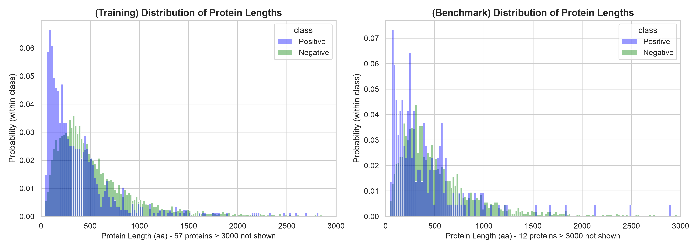
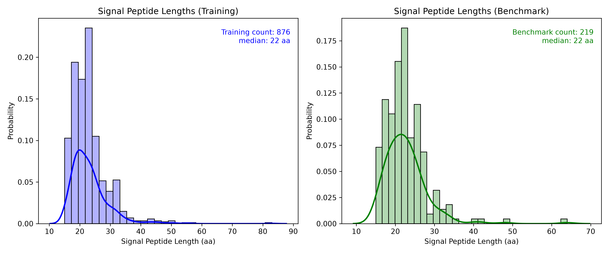
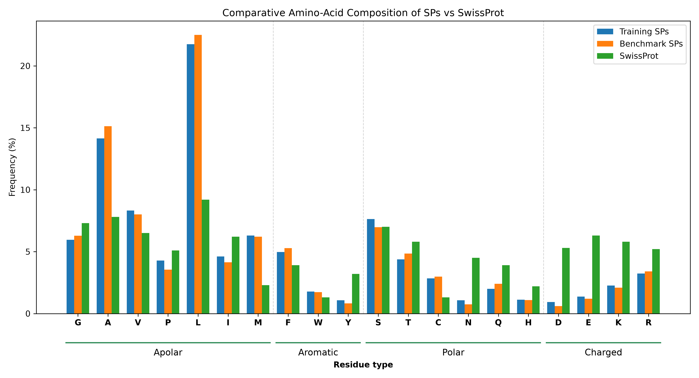
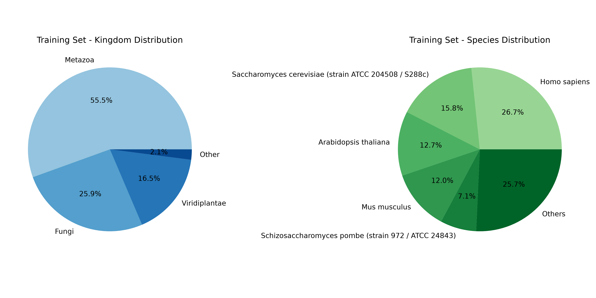
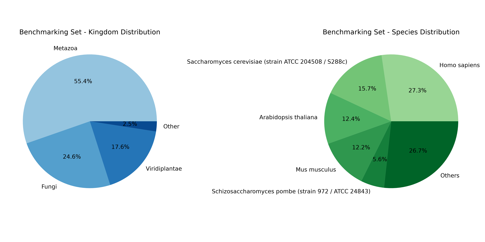
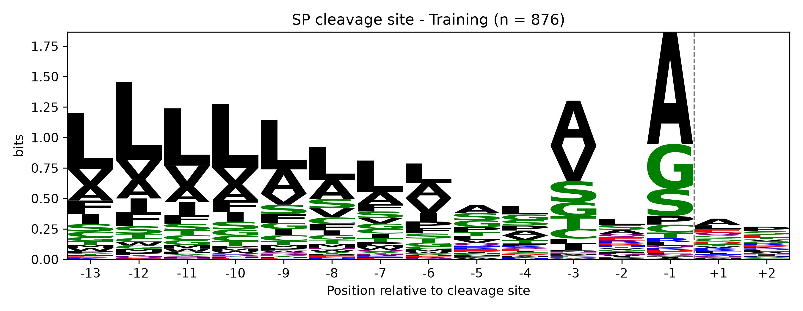
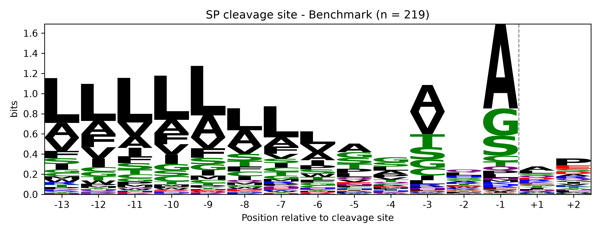

# Data Analysis
Before training any prediction method, we first look at our data. This step answers simple questions: How long are our proteins? How long are the signal peptides? Which amino acids do they contain? Which organisms do they come from? And what does the cleavage site look like?

Looking at the data first helps us:

check that the training and benchmark sets are similar (so the final test is fair),
spot biases in the data,
understand which features could help a model recognise a signal peptide (SP).

Script: [data_analysis.py](https://github.com/ma-umer/Group6_LOB2/blob/main/03.%20Data%20Analysis/data_analysis.py)

Output: [Plots](https://github.com/ma-umer/Group6_LOB2/tree/main/03.%20Data%20Analysis/plots)

## The data we analysed

The two datasets come from `02. Data Preparation`. Each one is described
**separately**, as asked in the course.

| Dataset | Proteins with SP (positives) | Proteins without SP (negatives) | Total |
|---|---:|---:|---:|
| Training | 876 | 7,265 | 8,141 |
| Benchmark | 219 | 1,817 | 2,036 |

> **Quick reminder:** a *signal peptide* is a short "address label"
> (about 20–30 amino acids) at the start (N-terminus) of a protein.
> It sends the protein into the secretory pathway and is then cut off at
> the *cleavage site*. It has three parts: a positively charged
> **n-region**, a hydrophobic (water-avoiding) **h-region**, and a
> **c-region** that contains the cleavage site.

## 1. Protein length



**What the plot shows:** how long the proteins are, comparing proteins with an SP (blue) and without an SP (green). Each colour is scaled to its own group, so the two shapes can be compared even though there are many more negatives. Very long proteins (over 3,000 amino acids) are left out to keep the plot readable.

**What we see:**

- Proteins **with** an SP tend to be **shorter**: most are under 500 amino acids, with a peak around 100–250.
- Proteins **without** an SP are spread over longer lengths, with a peak around 300–500.
- The training and benchmark plots look alike.

**Why it matters:** total length is different between the two groups, but our methods only look at the **start of the protein** (the first 90 amino acids), so this difference does not affect them.

---

## 2. Signal-peptide length



**What the plot shows:** how many amino acids long each signal peptide is.

**What we see:**

- Most SPs are **15–30 amino acids** long.
- The **median is 22 amino acids** in both sets.
- A few unusual SPs are longer (up to 83 in training and 64 in benchmark).
- Training and benchmark have almost the same shape.

**Why it matters:** this matches the expected SP length from the lectures (20–30 residues). Because SPs are short, it is enough to search only the **first 90 amino acids** of each protein.

---

## 3. Amino-acid composition: signal peptides vs SwissProt



**What the plot shows:** the percentage of each amino acid inside signal peptides (training in blue, benchmark in orange), compared with all proteins in SwissProt (green, the "normal" background). The amino acids are grouped by type: apolar, aromatic, polar and charged.

**What we see:**

| Amino acid | In SPs | In SwissProt | Meaning |
|---|---|---|---|
| **L** (leucine) | about 22% | about 9% | Much more common: L forms the **hydrophobic h-region** |
| **A** (alanine) | about 14–15% | about 8% | More common: A is typical of the **cleavage site** |
| **V, F, M** | higher | lower | Hydrophobic residues are enriched (M is high because every protein starts with M) |
| **D, E, K, N** | about 1–2% | about 4–6% | Much rarer: **charged and polar** residues are avoided |

**Why it matters:** SPs have a very clear "chemical fingerprint": **lots of hydrophobic residues, few charged ones**. This tells us that amino-acid composition and hydrophobicity are good features for a classifier such as the SVM.

---

## 4. Taxonomy: which organisms the proteins come from




**What the plots show:** the left pie chart groups proteins by **kingdom**; the right pie chart shows the most common **species**.

**What we see:**

| Kingdom | Training | Benchmark |
|---|---|---|
| Metazoa (animals) | 55.5% | 55.4% |
| Fungi | 25.9% | 24.6% |
| Viridiplantae (plants) | 16.5% | 17.6% |
| Other | 2.1% | 2.5% |

- About **three quarters** of all proteins come from just five model organisms: human (*Homo sapiens*, about 27%), baker's yeast (*S. cerevisiae*, about 16%), *Arabidopsis thaliana* (about 13%), mouse (*Mus musculus*, about 12%) and fission yeast (*S. pombe*, about 6–7%).
- Training and benchmark have almost the same proportions.

**Why it matters:** the data are **biased toward well-studied organisms**, because these are the proteins with experimental evidence in UniProt. A model trained on them may work less well on rarely studied organisms. Also, most proteins with an SP come from animals (about 80% of positives), so we should keep this in mind when we interpret the results.

---

## 5. Sequence logos of the cleavage site




**How we built it:** for every protein with an SP, we cut out the **15 amino acids around the cleavage site**: 13 before the cut (positions −13 to −1) and 2 after it (+1 and +2). These windows are saved in `motifs_training.*` and `motifs_benchmark.*`. Lining them up gives a sequence logo.

**How to read a logo:**

- Each column is one position. The dashed line is where the SP is cut.
- **Big letters** = that amino acid appears very often at that position.
- **Tall columns** = the position is very conserved (it carries a lot of information).

**What we see:**

- **Position −1:** a large **A** (alanine), with G and S below it.
- **Position −3:** **A** and **V**.
- Together these form the well-known **"A-x-A" motif**, the pattern recognised by the enzyme that cuts the SP.
- **Positions −13 to −6:** many **L** (leucine). This is the end of the hydrophobic **h-region**.
- **Positions +1 and +2:** almost no pattern. After the cut, the mature protein can start with almost anything.

**Why it matters:** this is exactly the pattern the **von Heijne method** learns. It builds a table (the weight matrix) of which amino acids are typical at each of these 15 positions, then uses it to find cleavage sites in new proteins.

---

## Summary

| Question | Answer |
|---|---|
| Are training and benchmark similar? | **Yes.** All plots look alike, so the benchmark is a fair final test. |
| How long are SPs? | About **22 amino acids** (most 15–30). |
| What are SPs made of? | Mostly **hydrophobic** residues (L, A, V), very few **charged** ones. |
| What does the cleavage site look like? | **A-x-A** motif at positions −3 and −1. |
| Any biases? | Most proteins come from **five model organisms**, and SP proteins are mostly from **animals**. |

**Next step:** use these findings to build the predictors in [`04. Model training`](../04.%20Model%20training): first the von Heijne weight matrix, then the SVM.

---

## How to run

```bash
pip install pandas numpy matplotlib seaborn
python "03. Data Analysis/data_analysis.py"
```

The plots are saved in `03. Data Analysis/plots/`.
