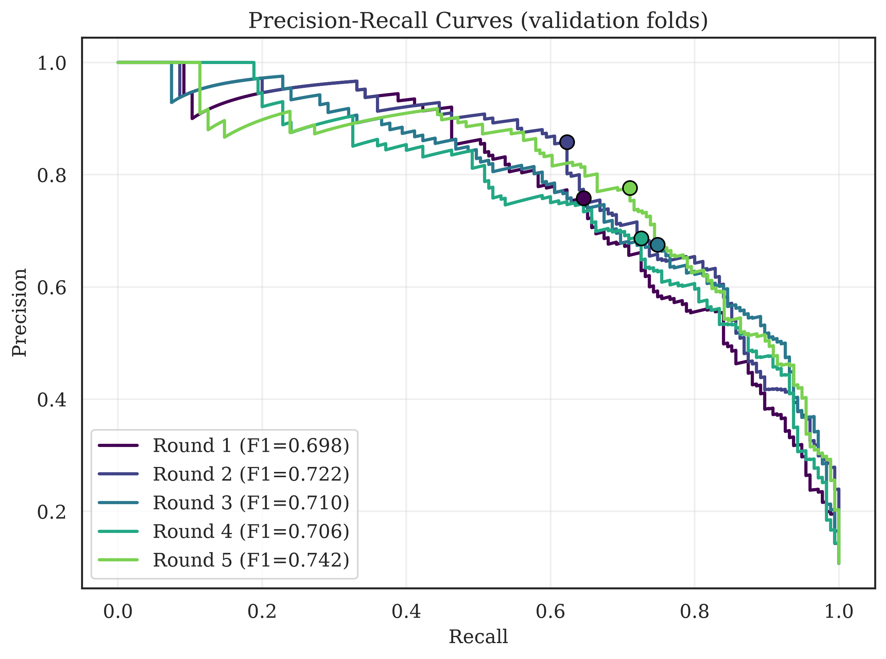
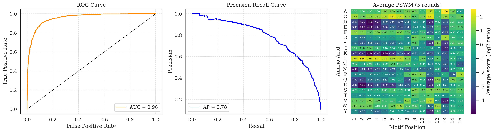
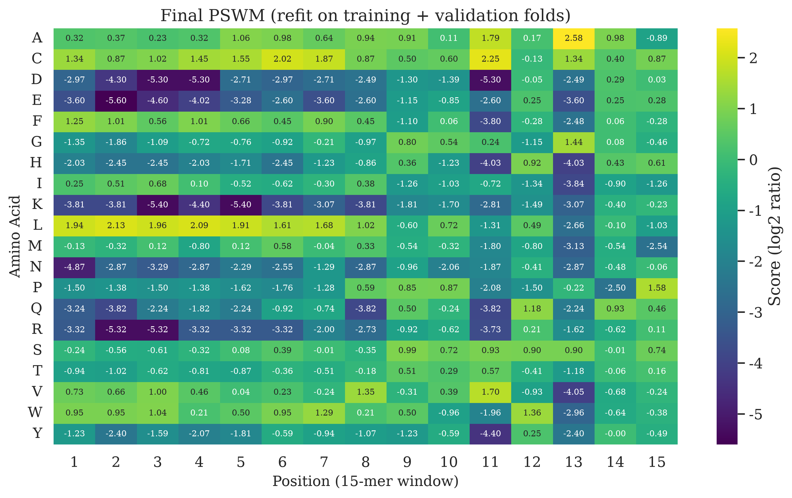
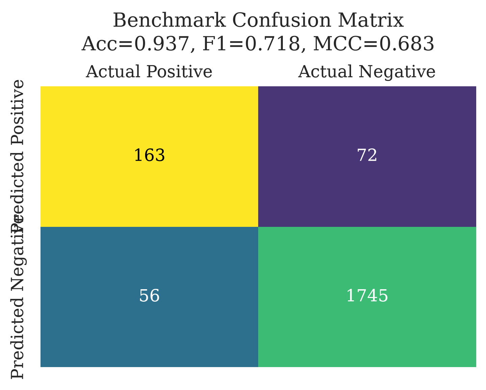

# 04 · Model Training

Laboratory of Bioinformatics 2 · Group 6 · University of Bologna

In this stage we build the signal-peptide (SP) predictors and tune them with **5-fold cross-validation** on the training set from [`02. Data Preparation`](../02.%20Data%20Preparation/cross_validation). The final model is then tested **once** on the held-out benchmark set. The full method comparison and discussion is in [`05. Model Evaluation`](../05.%20Model%20Evaluation).

| Method | Type | Input | Output | Status |
| --- | --- | --- | --- | --- |
| **von Heijne** | Position-specific weight matrix (PSWM) | 15-residue window around the cleavage site | SP score per protein + threshold | ✅ results below |
| **SVM** | Support Vector Machine (RBF kernel) | Features of the N-terminal region | SP / no-SP prediction | 🚧 in progress |

---

## Folder contents

<!-- TODO: add the script names -->

| File / folder | What it contains |
| --- | --- |
| `TODO_von_heijne.py` | PSWM construction, scoring, threshold selection and cross-validation |
| `model_results/cv_runs.tsv` | Test-fold metrics and threshold of each of the 5 rounds |
| `model_results/cv_summary.tsv` | Mean, standard deviation and standard error over the 5 rounds |
| `model_results/pswm_final.tsv` | Final PSWM (20 amino acids × 15 positions) |
| `model_results/benchmark_true_positives.tsv`, `benchmark_false_negatives.tsv` | Benchmark proteins correctly detected / missed, with score and SP annotation |
| `model_results/motifs_true_positives.tsv`, `motifs_false_negatives.tsv` | The 15-residue motifs of those proteins (for sequence logos) |
| `model_results/*.png` | Plots shown below |

---

## Input data

Both methods use the files in `02. Data Preparation/cross_validation/`:

- `pos_train.tsv`, `neg_train.tsv`: training proteins, with a `fold` column (1–5)
- `pos_bench.tsv`, `neg_bench.tsv`: held-out benchmark (used only for the final test)

| Set | Positives | Negatives | Total |
| --- | --- | --- | --- |
| Training | 876 | 7,265 | 8,141 |
| ↳ each fold | ≈ 175 | ≈ 1,453 | ≈ 1,628 |
| Benchmark | 219 | 1,817 | 2,036 |

Only the first **90 residues** of each protein are used, since SPs are short (median 22 aa; see `03. Data Analysis`).

---

## Cross-validation scheme

In each of the 5 rounds the folds play three roles. For example, round 1 uses fold 1 as test and fold 2 as validation; the remaining three folds are used for training.

| Role | Folds | Used for |
| --- | --- | --- |
| Training | 3 | building the PSWM |
| Validation | 1 | selecting the classification threshold |
| Test | 1 | unbiased performance estimate of that round |

| Round | Test fold | Validation fold |
| --- | --- | --- |
| 1 | 1 | 2 |
| 2 | 2 | 3 |
| 3 | 3 | 4 |
| 4 | 4 | 5 |
| 5 | 5 | 1 |

Metrics are reported as mean ± standard deviation over the 5 test folds. The classes are imbalanced (≈ 1 positive : 8 negatives), so the **MCC** and **F1** are more informative than accuracy.

---

## 1. von Heijne method

### How it works

1. **Collect motifs.** For every positive training protein, extract the 15 residues from position −13 to +2 around the annotated cleavage site.
2. **Count matrix.** Count how often each of the 20 amino acids appears at each of the 15 positions. <!-- TODO: pseudocount? -->
3. **Weights.** Convert counts into frequencies, then into log-odds scores relative to the background amino-acid frequencies <!-- TODO: SwissProt background? -->:

   `W(a, i) = log2( f(a, i) / b(a) )`

   where `f(a, i)` is the frequency of amino acid `a` at position `i` and `b(a)` its background frequency.
4. **Score a protein.** Slide the 15-residue window along the first 90 residues. The window score is the sum of `W` over its positions, and the **highest window score** is the protein's score.
5. **Classify.** A protein is predicted to have an SP if its score is above a threshold, chosen on the validation fold to maximise the F1 score (see the markers in the precision–recall plot).
6. **Final model.** The PSWM is refit on the training and validation folds ([`pswm_final.tsv`](model_results/pswm_final.tsv)) and applied to the benchmark set.

### Cross-validation results (test folds)

| Round | Accuracy | Precision | Recall | F1 | MCC | Threshold |
| --- | --- | --- | --- | --- | --- | --- |
| 1 | 0.945 | 0.803 | 0.648 | 0.717 | 0.692 | 9.97 |
| 2 | 0.942 | 0.839 | 0.566 | 0.676 | 0.660 | 10.86 |
| 3 | 0.942 | 0.713 | 0.766 | 0.738 | 0.706 | 9.20 |
| 4 | 0.932 | 0.659 | 0.771 | 0.711 | 0.675 | 8.96 |
| 5 | 0.932 | 0.684 | 0.680 | 0.682 | 0.644 | 9.41 |
| **Mean ± SD** | **0.938 ± 0.006** | **0.739 ± 0.078** | **0.686 ± 0.086** | **0.705 ± 0.026** | **0.675 ± 0.025** | **9.68 ± 0.76** |

Accuracy and MCC are stable across folds. Precision and recall vary more (SD ≈ 0.08), and they trade off against each other: rounds with a higher threshold (2) are precise but miss more SPs, rounds with a lower threshold (3, 4) the opposite.

### Benchmark results (final model)

|  | Predicted SP | Predicted no SP |
| --- | --- | --- |
| **Actual SP** (219) | 163 (TP) | 56 (FN) |
| **Actual no SP** (1,817) | 72 (FP) | 1,745 (TN) |

| Accuracy | Precision | Recall | F1 | MCC |
| --- | --- | --- | --- | --- |
| 0.937 | 0.694 | 0.744 | 0.718 | 0.683 |

The benchmark MCC (0.683) is within one standard deviation of the cross-validation mean (0.675 ± 0.025), so the model generalises to unseen, non-redundant proteins and was not over-tuned on the training folds.

---

## Plots

All figures are in [`model_results/`](model_results).

### Cross-validation

**Precision–recall curves of the 5 validation folds.** Dots mark the threshold with the best F1 on each fold. Validation F1 ranges from 0.698 (round 1) to 0.742 (round 5). The curves are close to each other, so the method is stable with respect to the choice of folds.



**Combined performance over the 5 test folds.** ROC curve (AUC = 0.96), precision–recall curve (AP = 0.78) and the PSWM averaged over the 5 rounds. The high AUC shows that the score separates the two classes well; the lower AP reflects the class imbalance, where the many negatives make high precision harder to keep at high recall.



**Confusion matrix pooled over the 5 test folds** (all 8,141 training proteins: 601 TP, 226 FP, 275 FN, 7,039 TN).


### Final model

**Final PSWM.** Log2-odds score of each amino acid at each position of the 15-residue window (position 1 = −13, position 13 = −1, position 15 = +2).



The matrix reproduces the known SP structure:
- **Positions 1–8 (−13 … −6), the hydrophobic h-region:** strongly favours L (up to +2.13), and also F, C, W, A, V; strongly penalises the charged and polar residues D, E, K, R, N, Q, H (down to −5.6).
- **Positions 11 and 13 (−3 and −1), the cleavage site:** strong preference for small residues, the **A‑x‑A** pattern (A +1.79 at −3 and +2.58 at −1; also C and V at −3), while charged and bulky residues are penalised.
- **Positions 14–15 (+1, +2):** weights close to 0, so the mature protein has almost no influence, with only a mild preference for P at +2.

### Benchmark

**Confusion matrix on the benchmark set.**



**Error analysis.** The 163 detected and 56 missed SPs (listed in `benchmark_true_positives.tsv` and `benchmark_false_negatives.tsv`) differ clearly in their scores: true positives score 9.3–20.4 (median 12.8), missed SPs 1.3–9.2 (median 7.4). Every missed SP therefore sits below the decision threshold, which lies between 9.17 and 9.31. The missed SPs have a weaker motif:

| Property | Detected (163) | Missed (56) |
| --- | --- | --- |
| Alanine at −1 | 60 % | 34 % |
| Leucine in the 15-mer | 24.5 % | 16.8 % |
| Alanine in the 15-mer | 18.7 % | 10.0 % |
| Isoleucine / phenylalanine in the 15-mer | 3.3 % / 4.3 % | 7.7 % / 7.3 % |
| D/E/K/R in the 15-mer | 6.1 % | 9.3 % |
| Median SP length | 22 aa | 22 aa |

So the false negatives are SPs with a less typical cleavage site (no A at −1) and a less leucine-rich h-region, not SPs of unusual length. The kingdom distribution is similar (Metazoa 75 % vs 77 %), with a slightly larger share of plants among the misses (16 % vs 11 %), but the numbers are small and we did not test this. No benchmark protein in either group has an N-terminal transmembrane helix. We did not save the false positives (72); a natural follow-up is to check whether they are proteins with N-terminal transmembrane helices, which are known to resemble SPs.

---

## 2. SVM

> 🚧 No SVM results are in `model_results/` yet. Sections below are to be completed.

### Features

<!-- TODO: list the real features -->

- amino-acid composition (TODO: which region, how many residues)
- hydrophobicity (TODO: which scale)
- TODO: charge, other physicochemical scales, window-based features

Features are scaled before training (TODO).

### Hyperparameter search

| Parameter | Values tried |
| --- | --- |
| Kernel | TODO |
| `C` | TODO |
| `gamma` | TODO |

| Round | C | gamma | Accuracy | Precision | Recall | F1 | MCC |
| --- | --- | --- | --- | --- | --- | --- | --- |
| 1–5 | TODO | TODO | TODO | TODO | TODO | TODO | TODO |
| **Mean ± SD** | | | TODO | TODO | TODO | TODO | TODO |

**Final model:** TODO.

---

## How to run

```bash
pip install pandas numpy scikit-learn matplotlib seaborn

python "04. Model training/TODO_von_heijne.py"
python "04. Model training/TODO_svm.py"
```

All random operations use seed **42**.

---

**Next step:** [`05. Model Evaluation`](../05.%20Model%20Evaluation): comparison of the methods and discussion.
